<div align="center">


# Elyps AI

### An AI video editor that edits like a person

Drop in a recorded talk, say what you want, and get back a finished, on-brand video with animated graphics timed to every word.

[Website](https://ayushpatnaikgit.github.io/Elyps-AI/) · [Install](#install) · [What it does](#what-it-does) · [How it works](#how-it-works) · [Costs](#costs) · [Privacy](#privacy-and-safety)

<br>

<a href="docs/elyps-demo.mp4">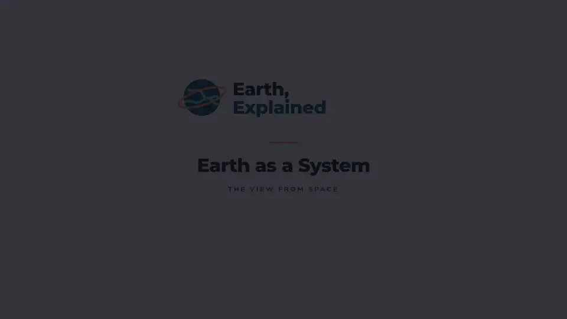</a>

<sub>▶ <a href="docs/elyps-demo.mp4"><b>Watch the 49-second demo with sound</b></a></sub>

</div>

<br>

## Quick start

With **[Docker Desktop](https://www.docker.com/products/docker-desktop/)** running (in its **Settings → Resources**, give it 8 GB of memory):

**Mac · Linux**
```sh
curl -fsSL https://raw.githubusercontent.com/ayushpatnaikgit/Elyps-AI/main/install.sh | sh
```

**Windows** (PowerShell)
```powershell
irm https://raw.githubusercontent.com/ayushpatnaikgit/Elyps-AI/main/install.ps1 | iex
```

It opens in your browser. Click **Settings** (bottom left) and add a Gemini key from [aistudio.google.com/apikey](https://aistudio.google.com/apikey). Put big camera files in the `Elyps/media` folder in your home folder and use **From disk** → `/media/<file name>`. A full edit costs about **$1–4** in Gemini usage.

`elyps update` gets new versions. `elyps status` tells you if anything's off. [More below ↓](#install)

<br>

## From this, to this

<table>
<tr>
<td width="50%">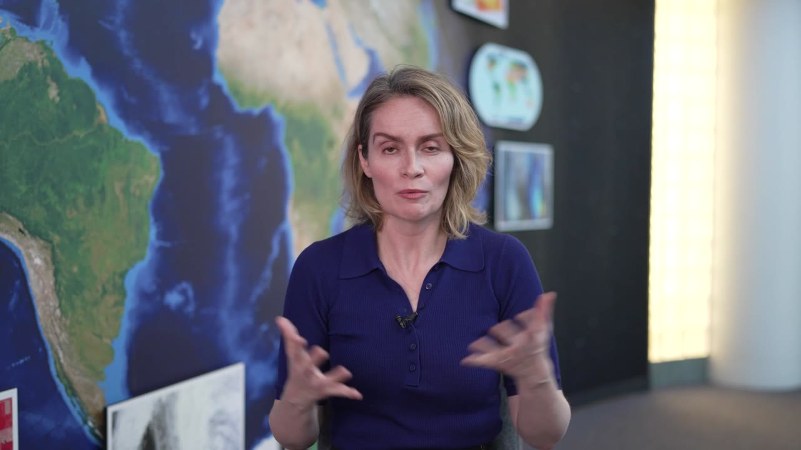</td>
<td width="50%">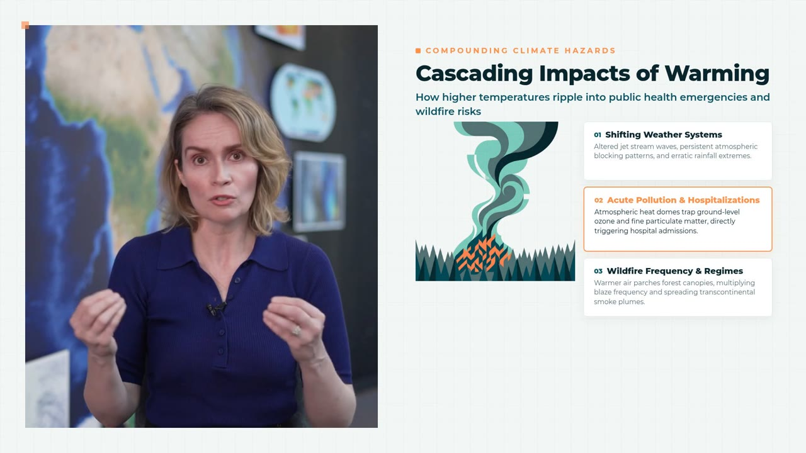</td>
</tr>
<tr>
<td align="center"><sub>What you drop in: a raw interview and a logo</sub></td>
<td align="center"><sub>What you get: synced, branded, with a graphic for every idea</sub></td>
</tr>
</table>

The brief for that video was one message:

> *Turn this interview into a short explainer for our channel, Earth, Explained. Add graphics at the key ideas, a clean intro and outro, and soft music. Use our logo and its colours.*

The agent did the rest. It took the palette from the logo, read the whole interview, proposed a plan, designed its own intro and outro, drew the illustrations, composed the music, animated each graphic to the moment it's said, checked its own frames, and rendered the final 1080p video.

<br>

## What it does

<table>
<tr>
<td width="50%" valign="top">

**🎙️ Syncs and cleans the sound**<br>
Lines up a separate mic recording with the camera to within a frame, and levels it for YouTube.

**📖 Understands the talk**<br>
Transcribes every word with timings, then reads the whole thing before deciding anything.

**🎨 Finds your brand**<br>
Name a website and it pulls the colours, fonts and logo from it. Or use what's in your brand kit.

**🔎 Researches the web**<br>
Looks up the speaker and the claims in the talk, with sources. It captures pages as screenshots or smooth scrolling recordings with the key line highlighted, ready to show in the video.

**✋ Asks before it builds**<br>
You get a plan first: a beat-by-beat list of what's said and the graphic it proposes. Approve it or redirect it.

</td>
<td width="50%" valign="top">

**🤝 Works as a team of agents**<br>
A lead agent plans the edit, then hands each graphic, and any research, to its own subagent. They all work at the same time.

**✏️ Writes its own animations**<br>
Every graphic is custom HTML, SVG and GSAP code (with d3 for charts), written for that idea: charts that draw themselves, diagrams that build as they're named. Nothing is picked from a template.

**🖼️ Makes illustrations and music**<br>
Illustrations in one consistent style, generated with Nano Banana. Background music composed with Lyria.

**👀 Checks its own work**<br>
Renders frames, looks at them with a vision model, and fixes whatever looks empty, cramped or off-brand.

**🖱️ Lets you change anything**<br>
Click any graphic, image or moment on the timeline and say what to change. Only that part is redone.

</td>
</tr>
</table>

<div align="center">
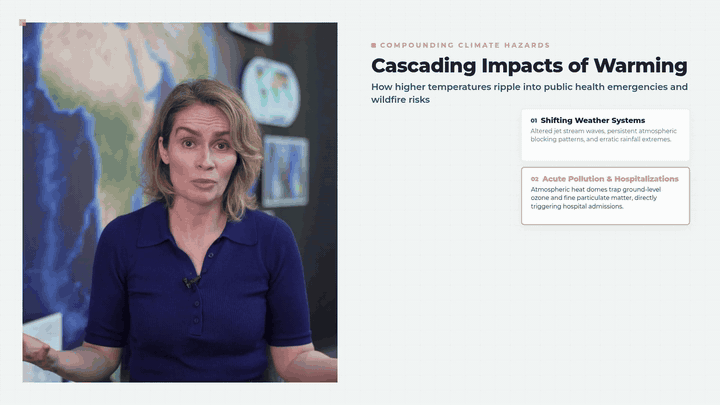
<br><sub>Graphics sit beside the speaker, never over them, and each element arrives as it's said.</sub>
</div>

<br>

### A few frames from one edit

<table>
<tr>
<td>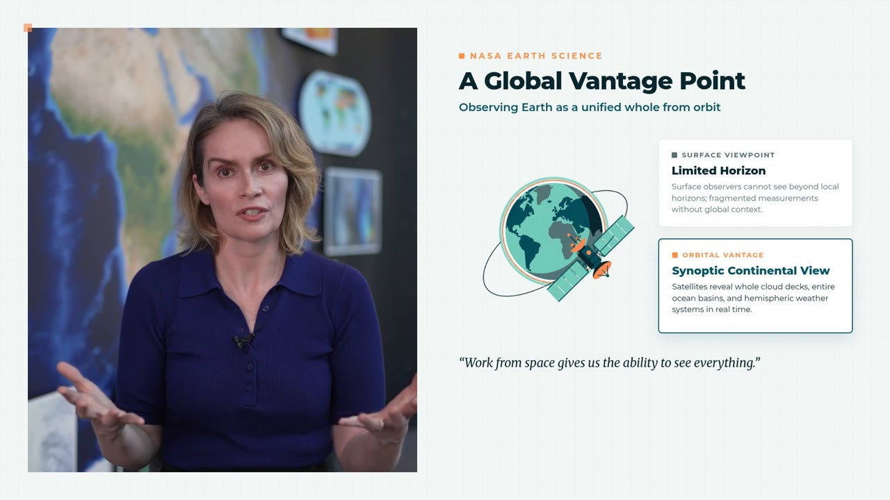</td>
<td>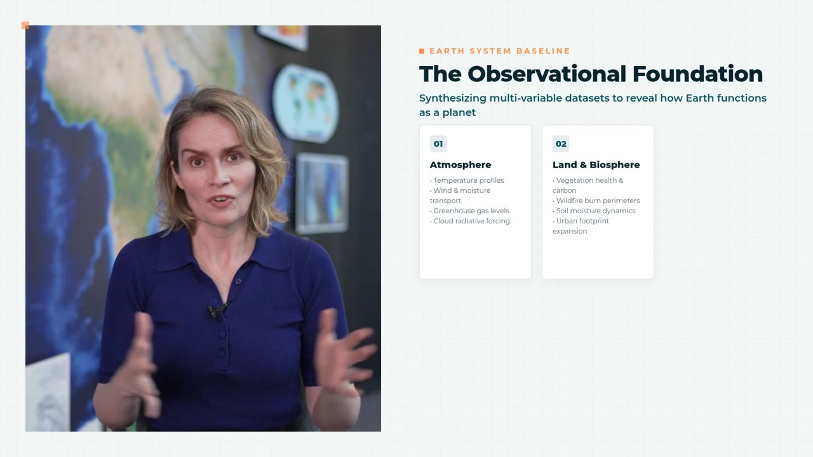</td>
<td>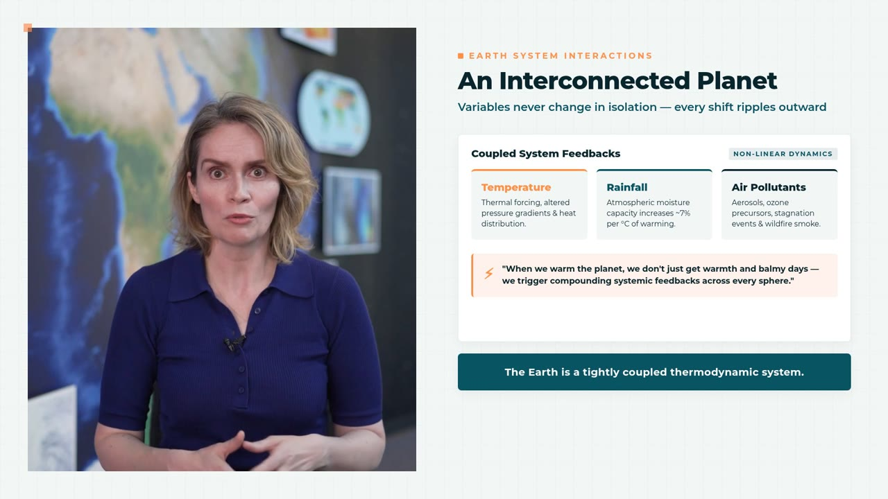</td>
</tr>
<tr>
<td>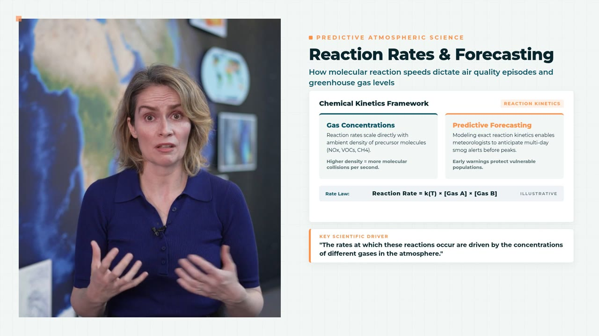</td>
<td>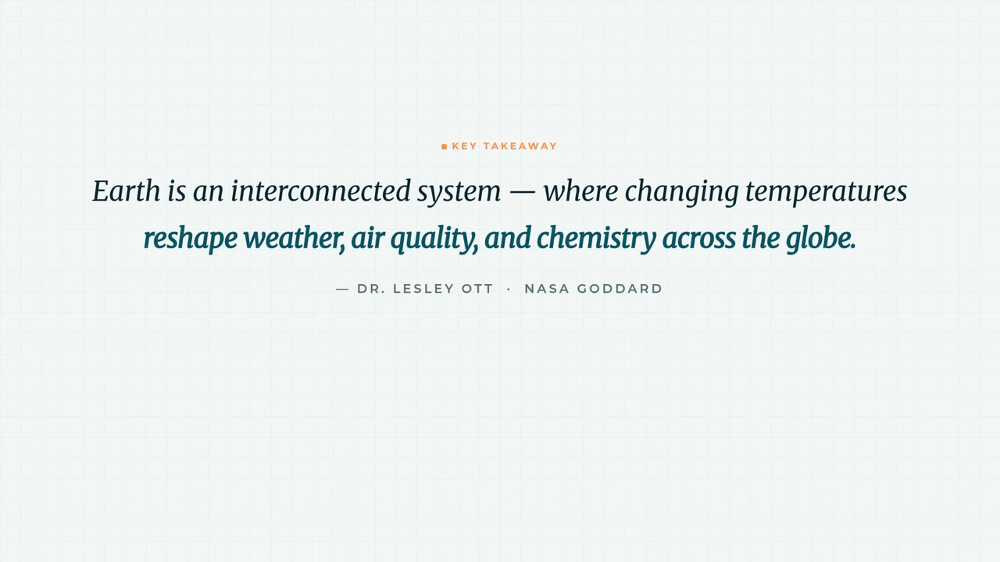</td>
<td>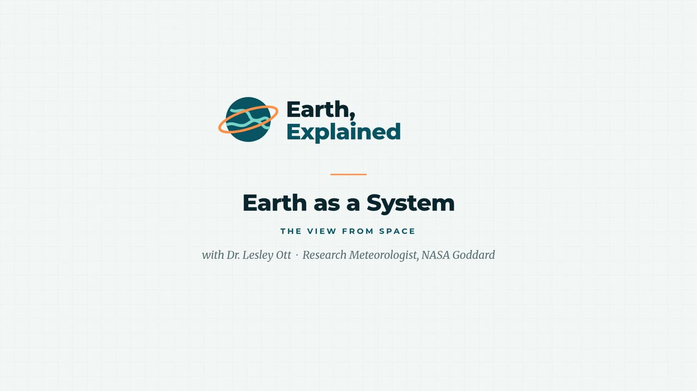</td>
</tr>
</table>

<br>

## The app

<table>
<tr>
<td width="50%">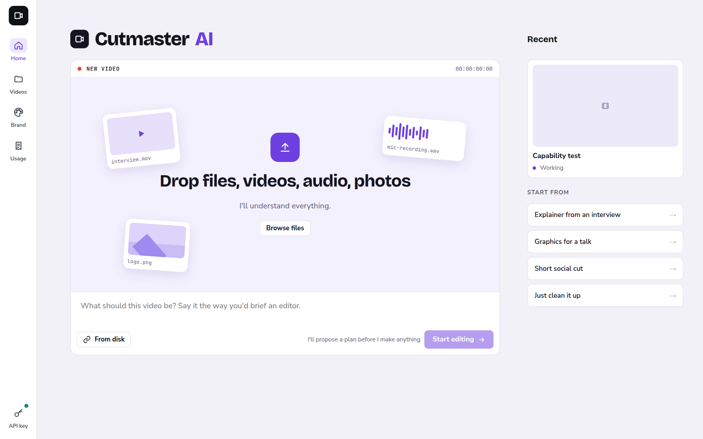</td>
<td width="50%">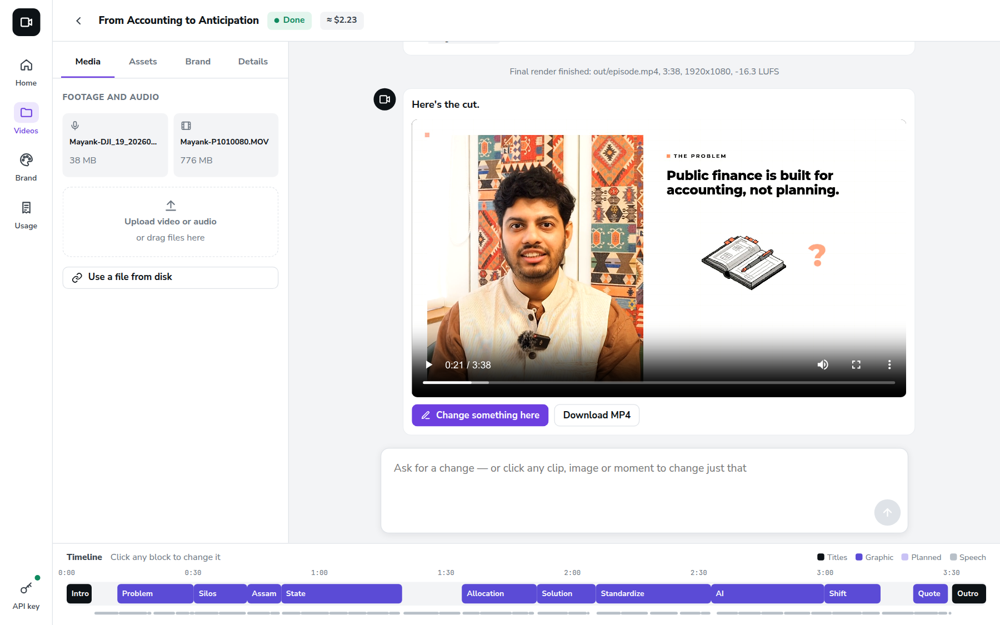</td>
</tr>
<tr>
<td align="center"><sub><b>Start</b>: drop your files and write a brief, the way you'd brief an editor</sub></td>
<td align="center"><sub><b>Finish</b>: watch the cut, then click any block on the timeline to change it</sub></td>
</tr>
</table>

It runs on your own computer and opens in your browser.

<br>

## Install

You need **[Docker Desktop](https://www.docker.com/products/docker-desktop/)** (Mac and Windows) or Docker Engine (Linux). Install it, open it once, then run:

**macOS · Linux**

```sh
curl -fsSL https://raw.githubusercontent.com/ayushpatnaikgit/Elyps-AI/main/install.sh | sh
```

**Windows** (PowerShell)

```powershell
irm https://raw.githubusercontent.com/ayushpatnaikgit/Elyps-AI/main/install.ps1 | iex
```

The installer:

1. creates a **Elyps** folder in your home folder, with a `media` folder for your footage;
2. downloads the app (a few GB, once; Intel and Apple Silicon both supported);
3. opens **http://localhost:4322** in your browser.

Then:

1. Click **Settings** (bottom left) and paste a [Gemini API key](https://aistudio.google.com/apikey). That one key runs the agent, the illustrations and the music.
2. Put your camera file and mic recording in `Elyps/media`.
3. On the home page choose **From disk**, enter `/media/<file name>` for each file, write your brief, and press **Start editing**.

> [!TIP]
> In Docker Desktop, go to **Settings → Resources** and give it **8 GB of memory** or more. Rendering 1080p video with a browser engine needs room. If anything is missing, the app's built-in system check tells you what and how to fix it.

### Everyday commands

| Command | What it does |
|---|---|
| `elyps start` | Start it and open the browser |
| `elyps stop` | Stop it (it also stops when Docker quits) |
| `elyps update` | Get the latest version; your videos are kept |
| `elyps status` | Is it running, and is everything it needs working? |
| `elyps logs` | What it's doing right now |
| `elyps media` | Open your footage folder |
| `elyps uninstall` | Remove it, keeping your videos unless you say otherwise |

When a new version is out, an **Update** button appears at the top right of
the app: one click and it restarts on the new version. (Installed before
1.2.0? Run the installer once more to get the one-click button.)

<br>

## How it works

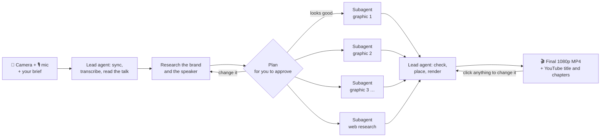

The editor is a team of agents working in one sandbox, with a terminal, a code editor and a set of tools: sync, transcription, web search and page capture, image and music generation, an HTML-to-video renderer and a Remotion timeline.

- The **lead agent** understands the material, researches the brand, plans the edit with you, and does the final assembly.
- **Subagents** each take one self-contained job and run at the same time. A graphics subagent designs one animation, writes it as code, renders stills, looks at them and fixes them. A research subagent looks things up and captures web pages.

| | |
|---|---|
| **Agent** | [OpenHands](https://github.com/OpenHands/OpenHands) driving **Gemini 3.8 Flash** (default) |
| **Checking frames** | Gemini 3.1 Pro |
| **Illustrations** | Nano Banana (Gemini image generation) |
| **Music** | Lyria 3 |
| **Transcription** | Whisper (faster-whisper), on your machine |
| **Video** | Remotion, ffmpeg and Chromium, on your machine |

Every model is **your choice**. Under **Settings → Models**, pick from the models your key can use: a stronger agent for hard edits, a different image model, a different music model. The choice applies to new videos.

How the agents are told to work is plain English in [`app/playbook/`](app/playbook/): [`AGENTS.md`](app/playbook/AGENTS.md) for the lead, [`GRAPHICS.md`](app/playbook/GRAPHICS.md) for graphics subagents, [`RESEARCH.md`](app/playbook/RESEARCH.md) for research. They're the thing to tune.

<br>

## Costs

The app is free. The AI runs on **your own Gemini API key**, so you pay Google directly for what you use:

| | Typical cost |
|---|---|
| A full edit of a 3–4 minute talk | **about $1–4** (our test episode: $3.50) |
| Each illustration | $0.07 |
| Each music track | $0.08 |
| Sync, transcription, rendering | free, on your computer |

The **Usage** page shows what each video cost, and you can set a monthly budget.

<br>

## Privacy and safety

- **Your footage stays on your computer.** It's read in place from your media folder and never uploaded. Only text, frames the agent checks, and generation prompts go to Google's API.
- **The agent never sees your key.** It runs as its own user inside the container, which can't read the encrypted key store. It reaches Gemini only through Elyps's local proxy, using a token that works only from inside the container, only for Gemini calls, and only while its job runs. A web page it reads while researching can't talk it into leaking the key, because it doesn't have the key.
- **The agent is sandboxed.** It runs code it writes itself, so it runs unprivileged inside the container. It can't see your files outside the media folder, which it can only read. **Stop** ends everything it started. The app only listens on `127.0.0.1`, so nobody else on your network can reach it.

<br>

## Your data

Projects, every job's working files, your brand kit, usage records and your key all live in a Docker volume. Updating or reinstalling never touches it.

```sh
elyps uninstall     # choose "y" to keep your videos, "delete" to remove everything
```

<br>

## For developers

<details>
<summary><b>Run from source</b></summary>

```sh
git clone https://github.com/ayushpatnaikgit/Elyps-AI && cd Elyps
cp .env.example .env          # optional: MEDIA_DIR, PORT
docker compose up --build     # http://localhost:4322
```

Without Docker (you need Node 22, Python 3.12+, ffmpeg, ImageMagick and Chrome):

```sh
./scripts/setup-local.sh
cd app && node server.mjs
```

> [!WARNING]
> Without Docker there is no sandbox: the agent runs code with your user's permissions. Only do this on a machine you're comfortable handing a shell to.

</details>

<details>
<summary><b>What's where</b></summary>

```
app/                  the web app, job queue and agent drivers (Node)
  server.mjs            HTTP API, uploads, projects, assets, usage, live events
  worker.mjs            prepares a workspace per job and runs the agent in it
  drivers/              OpenHands (default) and a dependency-free Gemini loop
  playbook/AGENTS.md    how the agent is told to work
  lib/doctor.mjs        the system check behind the home-page banner
  public/index.html     the whole UI
pipeline/             the editing toolkit copied into every job's workspace
  scripts/              sync, transcription, image and music generation,
                        HTML→MP4 graphics, music mixing, final render
  html/                 the graphics library: intro and outro scenes, helpers
  src/                  the Remotion edit
install.sh, install.ps1  the installers
```

</details>

<details>
<summary><b>Configuration</b></summary>

| Variable | Default | What it does |
|---|---|---|
| `PORT` | `4322` | Port the app is served on |
| `MEDIA_DIR` | `./media` | Host folder mounted read-only at `/media` (from source) |
| `ASK_TIMEOUT` | `7200` | Seconds the agent waits for your answer before deciding alone |
| `DATA_DIR` | `/data` | Projects, jobs, assets and the key |
| `PIPELINE_DIR` | `/app/pipeline` | The toolkit copied into each job |
| `OPENHANDS_PYTHON` | `python` | Python with `openhands-ai` installed |
| `CHROME_PATH` | `/usr/bin/chromium` | Browser used to render graphics |

Installer options: `ELYPS_HOME`, `ELYPS_PORT`, `ELYPS_IMAGE` and `ELYPS_NO_OPEN=1`.

</details>

<details>
<summary><b>Releasing</b></summary>

[`.github/workflows/release.yml`](.github/workflows/release.yml) builds the image on native Intel and Apple Silicon runners. It smoke-tests each build (every tool the agent needs must pass the system check), then publishes one multi-architecture image to `ghcr.io/ayushpatnaikgit/elyps`.

- Push to `main` → `:edge`
- Tag `vX.Y.Z` → `:X.Y.Z`, `:X.Y` and `:latest` (what the installers use)

</details>

<br>

## Licence

MIT; see [LICENSE](LICENSE).

Elyps renders video with [Remotion](https://www.remotion.dev), which is free for individuals and companies of up to three people. Larger organisations need a [Remotion company licence](https://www.remotion.pro).

<br>

<div align="center"><sub>Example footage: an interview with Dr. Lesley Ott, courtesy of <a href="https://svs.gsfc.nasa.gov/14553">NASA's Goddard Space Flight Center</a>. "Earth, Explained" is a made-up channel for the demo. NASA does not endorse Elyps.</sub></div>
